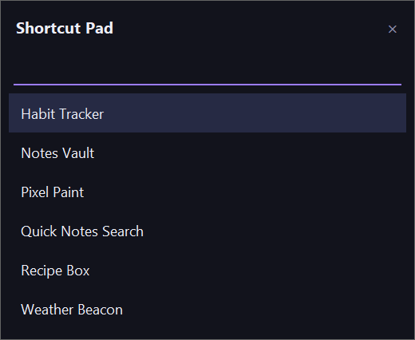

# Shortcut Pad

[](https://github.com/darkspaz-v1/launcher/actions/workflows/ci.yml)

One hotkey to reach any app in this suite, or fire a standalone action.



> The folder and the Python identifiers still say `launcher`. The rename to Shortcut Pad was
> deliberately display-only, to avoid path and import churn for a cosmetic change.

## How it works

- **`Ctrl+Alt+L`** opens a borderless palette. Type to filter, Enter to run.
- Entries come from `config.json` (created from `config.example.json` on first run). Each one launches a target — usually another app's `run.bat`, but
  any script or executable works.
- **An entry can carry its own global hotkey** (optional `hotkey` key), registered by
  `_register_item_hotkeys()` independently of the palette. Those fire the action directly with no
  palette popup.

## Notes from building it

- **It does not index the Start Menu.** The first version did, which meant every installed program
  showed up. A launcher listing everything is just the Start Menu with extra steps.
- The palette hotkey was originally `Ctrl+Alt+Space` and had to move: it collided with the Claude
  desktop app Quick Window. Windows keyboard hooks are not exclusive, so both fired on every press.
- **`config.json` is read only at startup.** A hotkey that does not work is almost always a config the
  running tray process has never read — exit the tray icon fully and relaunch.

**Stack:** Python, Tkinter (custom borderless palette), `keyboard`, `pystray`.

## Part of a suite

One of seven small Windows tray utilities built as separate, self-contained apps: each has its own
folder, its own virtualenv and its own `run.bat`, with no shared runtime. They are deliberately not a
framework — the only thing they share is a set of conventions.

| Convention | Why |
|---|---|
| Single-instance guard via a `.singleton.lock` file | An earlier `.instance.lock` design could get stuck after a force-kill and leave the app permanently unlaunchable |
| Relaunch brings the existing window forward | Previously a second launch silently did nothing, which was indistinguishable from the app being broken |
| Config lives in `config.json`, read at startup | Edit it, then fully exit the tray icon and relaunch — a running process never re-reads it |
| Tray icon generated in code (`icon.py`) | No binary asset to keep in sync |

## Quick start

```
python -m venv venv
venv\Scripts\pip install -r requirements.txt
run.bat
```

Windows only: these use Win32 APIs and a system tray. `config.json` holds your own paths and is
gitignored. On first run the app copies `config.example.json` to `config.json`. Targets may use
environment variables such as `%USERPROFILE%`, which are expanded when the palette opens.

Two entries that share a hotkey (or an entry that reuses the palette hotkey) are a conflict: the
palette hotkey wins, then the first item listed, and the rest are skipped with a warning in the log.

## Known limitations

- **Windows only.** The tray icon, global hotkeys, and `run.bat` all depend on Win32 APIs; there is
  no macOS or Linux build.
- **Hotkeys are global**, registered system-wide via the `keyboard` library. They can conflict with
  hotkeys other running apps already claim (see the `Ctrl+Alt+Space` note above) — the OS gives no
  warning, the keypress just does whatever registered first.
- **`config.json` must exist to have anything to launch.** The app creates it from
  `config.example.json` on first run, but on a read-only install directory that copy can silently
  fail (logged, not fatal) and the palette opens empty until you create the file yourself.

## Tests

```
pip install -r requirements-dev.txt
python -m pytest
```

## Troubleshooting

The app runs under `pythonw`, so there is no console. Launch and hotkey failures are logged to
`logs/launcher.log` (rotating, next to `app.py`). A crash at startup is written to `app_error.log`.

## License

MIT — see [LICENSE](LICENSE).
